# Week 2

<!-- TOC -->

- [Week 2](#week-2)
    - [Shapes](#shapes)
    - [Paths](#paths)
    - [Areas en Constructive Solid Geometry](#areas-en-constructive-solid-geometry)
        - [Vereniging (add)](#vereniging-add)
        - [Verschil (subtract)](#verschil-subtract)
        - [Doorsnede (intersect)](#doorsnede-intersect)
        - [Exclusieve of (xor)](#exclusieve-of-xor)
        - [Gebruik van CSG](#gebruik-van-csg)
    - [Strokes](#strokes)
    - [Paints](#paints)
        - [Color](#color)
        - [GradientPaint](#gradientpaint)
        - [LinearGradientPaint](#lineargradientpaint)
        - [RadialGradientPaint](#radialgradientpaint)
        - [TexturePaint](#texturepaint)
    - [Transformeren van shapes](#transformeren-van-shapes)
        - [Gebruiken van transformaties - Shape transformeren](#gebruiken-van-transformaties---shape-transformeren)
        - [Gebruiken van transformaties - Camera](#gebruiken-van-transformaties---camera)
        - [Gebruiken van transformaties - Inverse](#gebruiken-van-transformaties---inverse)
    - [Muisinteractie](#muisinteractie)
    - [Opgaven](#opgaven)

<!-- /TOC -->

## Shapes

Naast het tekenen van lijnen, kunnen we ook allerlei andere vormen tekenen. Al deze vormen erven over van de Shape klasse, en kunnen we met dezelfde ```draw``` methode tekenen. In de Java2D library zitten al een aantal klassen die deze shape klasse implementeren.
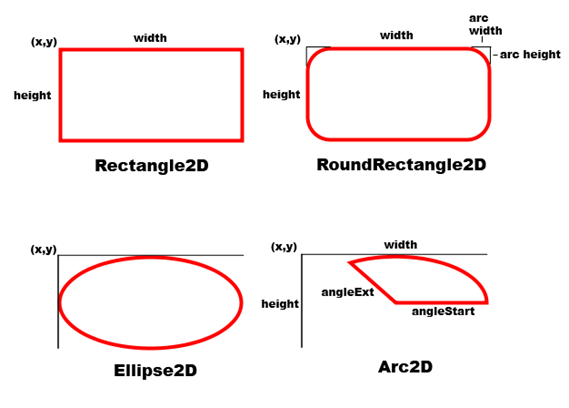

- Line2D
  Tekent een lijnstuk. Dit lijnstuk heeft een beginpunt en eindpunt
- Rectangle2D
  Tekent een rechthoek. De constructor ```new Rectangle2D.Double(double x, double y, double width, double height)``` kun je gebruiken om een rectangle te maken op een bepaalde positie
- Ellipse2D
  Tekent een ellipse. Je kunt de constructor ```new Ellipse2D.Double(double x, double y, double width, double height)``` een ellipse maken. Om een cirkel te tekenen kun je dit ook object gebruiken, met een gelijke breedte en hoogte.
- Arc2D
  Tekent een stuk van een cirkel of een ellipse. Je kunt de constructor ```new Arc2D.Double(double x, double y, double width, double height, double start, double extend, int type)``` gebruiken om een stuk van een ellipse te tekenen. Je kunt de positie aangeven, de grootte en waar begonnen moet worden. Deze hoek begint rechts met 0°, en gaat tegen de klok in. Je moet deze deze hoek in graden opgeven (0° - 360°).
- CubicCurve2D
  Je kunt met de ```CubicCurve2D.Double(double x1, double y1, double ctrlx1, double ctrly1, double ctrlx2, double ctrly2, double x2, double y2)``` een [Bézierkromme](https://nl.wikipedia.org/wiki/Bézierkromme) met 2 steunpunten tekenen. Je geeft een beginpunt op (x1,y1), een eindpunt (x2,y2), en 2 steunpunten. De curve zal door het begin en eindpunt gaan, maar niet door de steunpunten
- QuadCurve2D
  Je kunt met de ```QuadCurve2D.Double(double x1, double y1, double ctrlx, double ctrly, double x2, double y2)``` een [Bézierkromme](https://nl.wikipedia.org/wiki/Bézierkromme) met 1 steunpunt tekenen. Je geeft een beginpunt op (x1,y1), een eindpunt (x2,y2), en 1 steunpunt. De curve zal door het begin en eindpunt gaan, maar niet door het steunpunt
- RoundRectangle2D
  Je kunt met de ```RoundRectangle.Double(double x, double y, double width, double height, double arcwidth, double archeight)``` een rechthoek tekenen met afgeronde hoeken. De arcwidth en archeight geven aan hoe breed en hoog het hoekje zijn dat afgerond wordt.

Je kunt deze vormen tekenen met de ```Graphics.draw(Shape shape)``` of de ```Graphics.fill(Shape shape)``` methoden. De draw methode tekent een lijn in de vorm van de Shape die is opgegeven, en de fill methode vult de vorm op. Deze lijn of opvulling kun je een kleur geven met de ```setColor``` methode, maar kunnen we ook een beter opvulling geven. Hierover meer in de hoofdstukken over [Strokes](#Strokes) en [Paints](#Paints).

Daarnaast kun je aan shapes nog een aantal vragen stellen. Zo kun je bijvoorbeeld kijken of een punt binnen de shape is met de ```contains(Point2D point)``` methode. Deze methode kun je bijvoorbeeld gebruiken om te kijken of de gebruiker op een vorm heeft geklikt.
Daarnaast kun je ook een bounding-rectangle opvragen met de ```getBounds()``` methode. Dit is de rechthoek die de volledige shape omlijnt.

## Paths

Een speciale shape is een Path2D. Een Path is een combinatie van lijnen die gebruikt kunnen worden veel verschillende vormen te maken. De Path klasse wordt geïmplementeerd door de GeneralPath klasse, dus deze kunnen we gebruiken. Een generalpath werkt als een soort pen. Je kunt de pen over het canvas bewegen om zo een vorm te tekenen

```java
public void paintComponent(Graphics g)
{
    super.paintComponent(g);
    Graphics2D g2d = (Graphics2D)g;

    GeneralPath path = new GeneralPath();
    path.moveTo(100, 100);
    path.lineTo(200,100);
    path.lineTo(100,200);
    path.closePath();

    g2d.setColor(Color.green);
    g2d.fill(path);
    g2d.setColor(Color.black);
    g2d.draw(path);
}
```

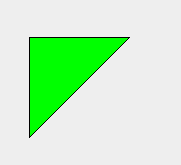

De GeneralPath klasse heeft de volgende methoden

- ```moveTo(double x, double y)``` Beweegt de cursor naar positie (x,y) zonder een lijn te tekenen
- ```lineTo(double x, double y)``` Tekent een lijn van de huidige locatie naar locatie (x,y)
- ```quadTo(double x1, double y1, double x2, double y2)``` Tekent een bezier curve naar (x1,y1) met steunpunt (x2,y2)
- ```curveTo(double x1, double y1, double x2, double y2, double x3, double y3)``` Tekent een bezier curve naar (x1,y1) met steunpunten (x2,y2) en (x3,y3)
- ```closePath()``` Sluit het pad met een rechte lijn naar het beginpunt

Om een vorm te vullen, moet je deze altijd afsluiten met closePath, anders kan de inkt weglekken en zou het hele scherm gevuld worden

Het is niet altijd voordehandliggend welk gedeelte van de shape gevuld wordt, zeker als de lijnen van het pad elkaar kruisen. Bekijk de volgende voorbeeldcode met de lijnen die hieruit komen:

```java
myShape = new GeneralPath();
myShape.moveTo(-2f, 0f);
myShape.quadTo(0f, 2f, 2f, 0f);
myShape.quadTo(0f, -2f, -2f, 0f);
myShape.moveTo(-1f, 0.5f);
myShape.lineTo(-1f, -0.5f);
myShape.lineTo(1f, 0.5f);
myShape.lineTo(1f, -0.5f);
myShape.closePath();
```

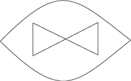

Als we deze vorm gaan opvullen, krijgen we een probleem, welke onderdelen worden er nu gevuld? In java kunnen we kiezen uit 2 verschillende manieren van vullen

- even-odd rule

  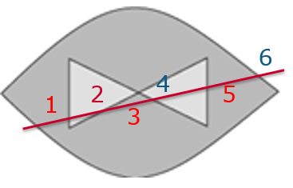

  We trekken een virtuele lijn door de vorm heen, en verhogen een teller op iedere plek waar de lijn door de shape heengaat. Buiten de shape staat de teller op 0. De plaatsen waar de teller even is zijn 'buiten' de vorm, de plaatsen waar de teller oneven is zit 'binnen' de vorm.
- nonzero rule

  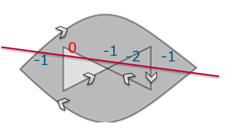

  We trekken weer een virtuele lijn door de vorm heen. Daarnaast geven we alle lijnen een richting (de richting waarin ze zijn getekent). Als we nu onze virtuele lijn volgen en de rand van de shape kruis van rechts, halen we 1 van de teller af, van links tellen we 1 bij de teller op. De plaatsen waar de teller 0 is zijn buiten de shape, op plaatsen waar de teller iets anders dan 0 is is binnen de shape.

## Areas en Constructive Solid Geometry

Een andere manier van 't maken van vormen is Constructive Solid Geometry. Dit is in het kort het combineren van 2 vormen om een nieuwe vorm te maken. Dit kunnen we doen met 3 operaties

### Vereniging (add)

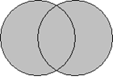

Door de vereniging te nemen van 2 vormen, krijg je een nieuwe vorm met een combinatie van beide vormen. Er komt 1 nieuwe vorm uit, en de lijnstukken die tussen de 2 vormen in zitten, vallen weg

### Verschil (subtract)

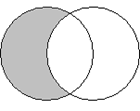

Geeft eerste vorm, waar de tweede vorm als een hap uitgenomen is. Dit kan gaten opleven in de vorm. Let op de volgorde van de vormen, het verschil tussen vorm A en B, en B en A is anders.

### Doorsnede (intersect)

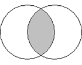

Geeft alleen de ruimte die beide vormen zit.

### Exclusieve of (xor)

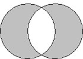

Geeft alleen de ruimte die of in de een, of in de andere vorm zit, maar niet allebei. Is gelijk aan ```Verschil(Vereniging(A, B), Doorsnede(A, B))```

### Gebruik van CSG

In java werkt CSG door middel van de [Area](https://docs.oracle.com/javase/7/docs/api/java/awt/geom/Area.html) klasse. Deze klasse is ook een Shape, en kan gemaakt worden op basis van een shape in de constructor. Door een bestaande Shape in een Area te encapsuleren kun je dus gemakkelijk CSG operaties hierop toepassen, en het resultaat kun je meteen tekenen.

```java
public void paintComponent(Graphics g)
{
    super(g);
    Graphics2D g2d = (Graphics2D)g;

    Area a = new Area(new Ellipse2D.Double(0,0,100,100));
    Area b = new Area(new Ellipse2D.Double(50,0,100,100));

    Area added = new Area(a);
    added.add(b);

    Area sub = new Area(a);
    sub.subtract(b);

    Area intersect = new Area(a);
    intersect.intersect(b);

    Area xor = new Area(a);
    xor.exclusiveOr(b);

    g2d.translate(25,25);

    g2d.setColor(Color.lightGray);
    g2d.fill(added);
    g2d.setColor(Color.black);
    g2d.draw(a);
    g2d.draw(b);

    g2d.translate(0,150);
    g2d.setColor(Color.lightGray);
    g2d.fill(sub);
    g2d.setColor(Color.black);
    g2d.draw(a);
    g2d.draw(b);

    g2d.translate(0,150);
    g2d.setColor(Color.lightGray);
    g2d.fill(intersect);
    g2d.setColor(Color.black);
    g2d.draw(a);
    g2d.draw(b);

    g2d.translate(0,150);
    g2d.setColor(Color.lightGray);
    g2d.fill(xor);
    g2d.setColor(Color.black);
    g2d.draw(a);
    g2d.draw(b);
}
```

Het is natuurlijk ook mogelijk om verschillende operaties achter elkaar uit te voeren op 1 Area, bijvoorbeeld door er een aantal keer verschillene stukjes af te hakken.

Je kunt CSG gebruiken om nieuwe vormen te maken, maar je kunt er nog meer mee doen

- Overlap detecteren
- Onwikkelen van grote complexe vormen (levels)

## Strokes

De ```Graphics2D.draw()``` methode tekent standaard een simpele lijn. Deze lijn noemen we een '[Stroke](https://docs.oracle.com/javase/7/docs/api/java/awt/Stroke.html)'. De stroke kun je instellen met de [```setStroke(Stroke newStroke)```](https://docs.oracle.com/javase/7/docs/api/java/awt/Graphics2D.html#setStroke(java.awt.Stroke)) methode. Een van de stroke-klassen is de [BasicStroke](https://docs.oracle.com/javase/7/docs/api/java/awt/BasicStroke.html). Met deze stroke kun je de dikte instellen, het soort afrondingen aan het einde van de lijn, en hoe de knikken in de lijnstukken getekend worden. Daarnaast kun je ook een streeppatroon instellen. Dit kan allemaal met de ```BasicStroke(float width, int cap, int join, float miterlimit, float[] dash, float dash_phase)``` constructor, maar het is ook mogelijk de laatste opties weg te laten met bijvoorbeeld de ```BasicStroke(float width, int cap, int join)``` constructor. De width geeft de breedte van de lijnen aan. De cap en join geven de eindes en tussenstukken van lijnstukken aan.

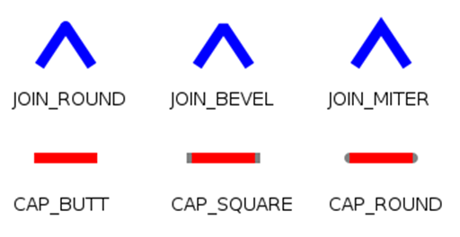

- JOIN_ROUND geeft een afgeronde hoek bij scherpe hoeken
- JOIN_BEVEL knipt een hoek af bij scherpe hoeken
- JOIN_MITER laat een scherpe punt bij scherpe hoeken
- CAP_BUTT geeft geen extra stukken bij het uiteinde van de lijnstukken
- CAP_SQUARE zet een extra, recht stuk aan het uiteinde van de lijnstukken met lengte van de helft van de breedte
- CAP_ROUND rond de uiteinden van de lijnstukken af met een cirkel
  ```java
  Stroke s = new BasicStroke(4.0f,
                             BasicStroke.JOIN_ROUND,
                             BasicStroke.CAP_ROUND);
  ```

Deze waarden zijn integer constanten in de BasicStroke klasse, en kunnen gebruikt worden in de constructor. In het geval van de JOIN_MITER, kun je ook een extra parameter aan de constructor meegeven die de limiet van de miter-join aangeeft. Deze limiet is de diagonale afstand van de miter, dus de afstand tussen de binnenste en buitenste hoek. Standaard staat deze op 10.0f.

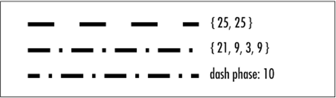
Daarnaast is het ook mogelijk een streep-patroon mee te geven. Deze patronen kun je in een array doorgeven en je kunt een verschuiving aangeven in een parameter. In de array staat de lengte van de gekleurde gebieden en hierna de lengte van de nietgekleurde gebieden. Het is dus eigenlijk altijd een array met een even aantal elementen. Door de verschuiving kun je aangeven waar in het patroon begint

## Paints

De ```Graphics2D.fill()``` methode kan een vorm invullen. Standaard is dit met een enkele kleur, maar dit kun je instellen met de ```Graphics2D.setPaint(Paint paint)``` methode. Hier kun je een paint object meegeven, dat bepaalt hoe de vorm gevuld wordt.

### Color

De color klasse implementeerd ook de Paint interface, en kun je gebruiken om een Shape in 1 kleur in te kleuren. De kleur kun je aanmaken met alle constructoren van Color, op dezelfde manier als [setColor](Les1#Kleuren)

### GradientPaint

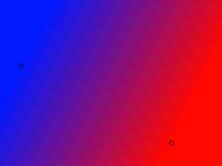

Een GradientPaint maak je aan met 2 punten en 2 kleuren. Java zal dan lineair interpoleren over een lijn die tussen deze 2 punten loopt. Je kunt in de constructor ook aangeven of deze gradient cyclisch of asyclisch is. Een cyclische gradient zal zichzelf blijven herhalen na de 2 punten, en een acyclische gradienet blijft dezelfde kleur na deze 2 punten

### LinearGradientPaint

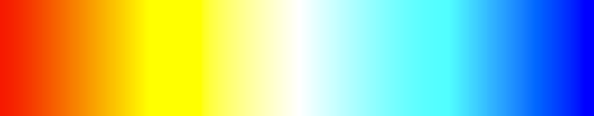
Een [LinearGradientPaint](https://docs.oracle.com/javase/7/docs/api/java/awt/LinearGradientPaint.html) heeft 2 punten en meerdere kleuren. Daarnaast kun je aangeven hoeveel een bepaalde kleur in verhouding gebruikt moet worden. Je kunt hier dus hetzelfde mee als met eenGradientpaint, maar ook meer, door meerdere kleuren toe te voegen. De standaard constructor ```LinearGradientPaint(float startX, float startY, float endX, float endY, float[] fractions, Color[] colors)``` zal een acyclische gradientpaint maken die van het startpunt tot het eindpunt de kleuren lineair interpoleert, en daarna een constante kleur blijft. De fractions zijn hierbij een lijst met floating point waarden tussen 0 en 1, in oplopende volgorde, die aangeven waar in de gradient de kleur zich bevind. 0 is (startX,startY), 1 is (endX,endY), 0.5 is precies halverwege

### RadialGradientPaint

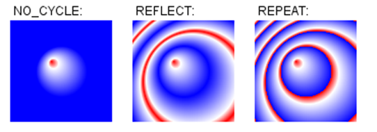
Een RadialGradientPaint is een gradientpaint die in een cirkel vanuit een punt van kleur verloopt. Hierbij kan nog een tweede focuspunt aangegeven worden om het middelpunt te verschuiven. Ook wordt hier een array aan kleuren meegegeven zoals bij een LinearGradientPaint.
Om een RadialGradientPaint te gebruiken kun je de ```RadialGradientPaint(Point2D center, float radius, Point2D focus, float[] fractions, Color[] colors, MultipleGradientPaint.CycleMethod cycleMethod)``` constructor aanroepen, waar je een centrum, straal en focuspunt kan opgeven, en daarnaast de lijst met kleuren en fractions om de kleuren aan te geven. Daarnaast kun je een cycleMethod opgeven waarmee aangegeven wordt hoe het patroon herhaald wordt.

### TexturePaint

Een TexturePaint maakt gebruik van een afbeelding om een shape op te vullen. Deze afbeelding is in de vorm van een BufferedImage, en wordt herhaald. In de constructor van de TexturePaint moet dus een BufferedImage meegeven worden en ook een Rectangle die aangeeft waar de afbeelding geplaatst moet worden. Om een afbeelding in te laden, kunnen we de ImageIO klasse gebruiken. Let erop dat je deze afbeelding maar 1x inlaad, dus in de constructor van je klasse, en niet bij het tekenen.

```java
BufferedImage texture;

HelloTexturePaint()
{
    try {
        texture = ImageIO.read(getClass().getResource("/images/texture.jpg"));
    } catch (IOException | IllegalArgumentException e) {
        e.printStackTrace();
    }
}

public void paintComponent(Graphics g)
{
    super.paintComponent(g);
    Graphics2D g2d = (Graphics2D)g;

    g2d.setPaint(new TexturePaint(texture, new Rectangle2D.Double(0,0,400,400)));
    g2d.fill(new Rectangle2D.Double(0,0,getWidth(), getHeight()));

}
```

## Transformeren van shapes

Naast het transformeren van het hele venster, is het ook mogelijk om ee nshape los te transformeren, en hier een nieuwe shape van te maken. Op deze manier kunnen we gemakkelijk een enkel object verplaatsen, zonder het hele canvas te verplaatsen of de shape zelf aan te passen. Dit is straks erg handig voor het laten animeren van objecten.

Om een complete transformatie voor te stellen kunnen we de AffineTransform klasse gebruiken. Een AffineTransform is een klasse die een (combinatie van) transformaties op kan slaan, en deze ook kan toepassen op vormen en punten. Intern slaat de AffineTransform een matrix op, die we kunnen manipuleren met de verschillende methoden. Voor standaard 2D transformaties wordt een 3x3 matrix gebruikt, maar omdat de onderste rij eigenlijk altijd [0, 0, 1] is, wordt deze weggelaten in de AffineTransform klasse, en slaat deze dus een 3x2 matrix op. Daarom dat je in de verschillende methoden die direct de matrix aanpassen ook maar 6 parameters ziet. Deze matrices kunnen we zelf samenstellen
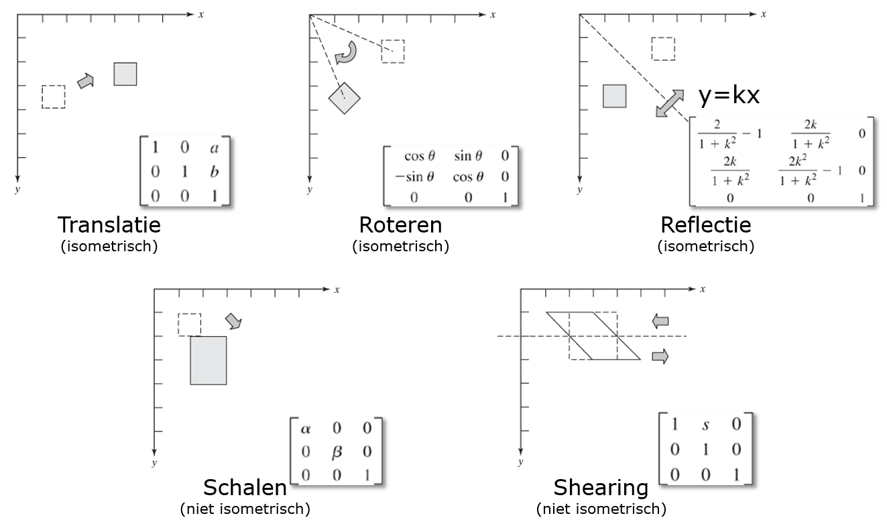
Deze matrices kun je zelf berekenen in een AffineTransform zetten door middel van de constructor. Stel dat je een shear wil doen over de X-as met een factor 2, kun je de matrix
 gebruiken. De onderste rij gebruiken we niet, dus we kunnen deze in java invullen met de constructor ```new AffineTransform(1,2,0,0,1,0);```. Om deze nu met elkaar te combineren, kunnen we de volgende code gebruiken

```java
AffineTransform tx = new AffineTransform();
tx.translate(10,10);
tx.concatenate(new AffineTransform(1,2,0,0,1,0));
tx.scale(0.5, 0.5);
```
In deze code worden 2 AffineTransforms gecombineerd, en worden ze verder aangepast. De ```translate```, ```rotate``` en ```scale``` methoden werken op een transform door, en worden dus automatisch gecombineerd. Let hierbij ook weer op de volgorde van transformeren.

_todo:_ matrixvermenigvuldigingen en volgorde

### Gebruiken van transformaties - Shape transformeren

De AffineTransform heeft ook een [```createTransformedShape()```](https://docs.oracle.com/javase/7/docs/api/java/awt/geom/AffineTransform.html#createTransformedShape(java.awt.Shape)) methode. Hiermee kun je een shape transformeren, om 'm op een andere plek te zetten. Op deze manier kun je dus gemakkeljk een AffineTransform gebruiken om een Shape te verplaatsen, zonder de shape aan te passen. Dit doe je met de ```createTransformedShape(Shape shape)``` methode in de AffineTransform. Op deze manier kun je gemakkelijk ieder object een eigen positie, rotatie en schaal geven, en deze flexibel aanpassen. We krijgen dan dus de volgende code

```java
class Renderable
{
    private Shape shape;
    private Point2D position;
    private float rotation;
    private float scale;

    public Renderable(Shape shape, Point2D position, float rotation, float scale)
    {
        this.shape = shape;
        this.position = position;
        this.rotation = rotation;
        this.scale = scale;
    }

    public void draw(Graphics2D g2d)
    {
        g2d.draw(getTransformedShape());
    }

    public Shape getTransformedShape()
    {
        return getTransform().createTransformedShape(shape);
    }

    public AffineTransform getTransform()
    {
        AffineTransform tx = new AffineTransform();
        tx.translate(position.getX(), position.getY());
        tx.rotate(rotation);
        tx.scale(scale,scale);
        return tx;
    }
}
```

Let bij het gebruik van deze code dat het object waar je een shape van maakt om zijn oorsprong draait, dus gebruik bijvoorbeeld een ```new Rectangle(-50,-50,100,100)``` voor een blok dat om zijn middelpunt draait. Deze coördinaten noemen we coördinaten in de lokale ruimte, de 'object space'.

### Gebruiken van transformaties - Camera

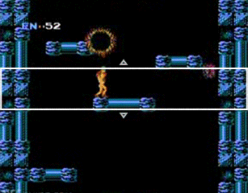<!--http://prostheticknowledge.tumblr.com/post/118534852886/scroll-back-gaming-study-by-itaykeren-looks-at-the-->

In veel applicaties kunnen we het viewport verplaatsen, en in of uitzoomen op een wereld. Denk hierbij bijvoorbeeld aan een applicatie waar een wereld van boven bekeken wordt, of een sidescrolling game. Dit doen we door een transformatie uit te voeren op het gehele venster. Dit kan in Java door middel van de ```Graphics2D.setTransform(AffineTransform transform)``` methode. Dit werkt op dezelfde manier als dat we in [Les 1](Les1#Transformaties) hebben gedaan, maar nu kunnen we een AffineTransform object meegeven in plaats van losse translate, rotate en scale methoden te gebruiken. We kunnen hiervoor een camera object definiëren die een AffineTransform genereerd

```java
class Camera
{
    private Point2D target;
    private float zoom;
    ...
}
```

We kunnen nu spreken van een aantal verschillende coördinatenstelsels

- Screen Space. Dit zijn de scherm-pixel coordinaten en lopen van 0 tot de hoogte en breedte van het scherm
- World Space. Dit zijn de coordinaten in de wereld. Deze coördinaten kun je bijvoorbeeld uit een bestand inladen om een wereld op te bouwen
- Object Space. Dit zijn de lokale coördinaten. Deze coördinaten zijn relatief ten opzichte van de oorsprong van je object


Door nu transformaties op een slimme manier te combineren, kunnen we transformeren van object space naar screen space. We hebben dus een object in model space, dit wordt door een object-transformatie omgezet naar world space, en door de camera-transformatie omgezet naar screen space.

### Gebruiken van transformaties - Inverse

Als een camera gebruikt wordt om het scherm te scrollen, wordt het bepalen van de wereld-coördinaten van een muisklik een stuk lastiger. Er moet rekening gehouden worden met de positie, zoom en eventueel rotatie van de camera. Om dit op te lossen kunnen we inverse van de cameratransformatie gebruiken. Als we de inverse van de cameratransformatie toepassen op de locatie van de muiscursor, krijgen we de wereld-coördinaten van dat punt. De AffineTransform klasse heeft hier de methode ```inverseTransform(Point2D source, Point2D destination)``` voor. Deze methode kun je op verschilende manieren gebruiken:

```java
Point2D mousePosition = .....;
Point2D transformed1 = new Point2D.Double();
//manier 1, zet de getransformeerde waarde in een andere variabele
cameraTransform.inverseTransform(mousePosition, transformed1);

//manier 2, door null mee te geven, returned de methode een nieuw point2D
Point2D transformed2 = cameraTransform.inverseTransform(mousePosition, null);

// manier 3, je kunt ook het punt in-place transformeren zonder nieuwe punten aan te maken
cameraTransform.inverseTransform(mousePosition, mousePosition);
```

Door nu positie van de muis op te vragen (zie [Muisinteractie](#Muisinteractie)), gemakkelijk berekend worden welk object aangeklikt is, in combinatie met de transformatie van de camera

## Muisinteractie

De muis werkt in java event-driven, op basis van de MouseListener, MouseMotionListener en MouseWheelListener interfaces. Deze interfaces bevatten methoden die aangeroepen worden op 't moment dat er iets gebeurt met de muis. Deze listener kan hierna met de ```addMouseListener()```, ```addMouseMotionListener()``` of ```addMouseWheelListener()``` methoden van het JPanel toegevoegd worden. Het is ook mogelijk om meerdere mouselisteners te hebben op een paneel, maar dit is af te raden als je een enkele applicatie hebt, omdat er dan ongewenst dingen dubbel kunnen gebeuren met de muis, de communicatie tussen verschillende mouselisteners is lastig. Een voorbeeld:

```java
public class HelloMouse extends JPanel implements MouseListener, MouseMotionListener {
    public static void main(String[] args)
    {
        JFrame frame = new JFrame("Hello Java2D");
        frame.setDefaultCloseOperation(WindowConstants.EXIT_ON_CLOSE);
        frame.setMinimumSize(new Dimension(800, 600));
        frame.setExtendedState(frame.getExtendedState() | JFrame.MAXIMIZED_BOTH);
        frame.setContentPane(new HelloMouse());
        frame.setVisible(true);
    }

    HelloMouse()
    {
        addMouseListener(this);
        addMouseMotionListener(this);
    }

    public Point2D position = new Point2D.Double(100,100);

    public void paintComponent(Graphics g)
    {
        super.paintComponent(g);
        Graphics2D g2d = (Graphics2D)g;
        g2d.setStroke(new BasicStroke(20));
        g2d.draw(new Rectangle2D.Double(position.getX()-50, position.getY()-50, 100, 100));
    }

    public void mouseClicked(MouseEvent e) {}
    public void mousePressed(MouseEvent e) {}
    public void mouseReleased(MouseEvent e) {}
    public void mouseEntered(MouseEvent e) {}
    public void mouseExited(MouseEvent e) {}

    public void mouseDragged(MouseEvent e) {
        position = e.getPoint();
        repaint();
    }

    public void mouseMoved(MouseEvent e) {}
}
```

Deze code zal een paneel aanmaken met een MouseListener en MouseMotionlistener erop, en zodra gesleept wordt, wordt de positie van een rectangle aangepast. De mouseDragged methode wordt automatisch aangeroepen zodra de muis gesleept wordt (met een muisknop ingedrukt).

Van het MouseEvent kunnen een aantal eigenschappen opgevraagd worden. Zo kun je met de ```getPoint()``` opvragen waar de muiscursor is, met ```getClickCount()``` hoevaak er is geklikt (dus om dubbelkliks te detecteren). Met de ```getButton()``` methode kun je opvragen welke knop is ingedrukt. Deze waarde kun je vergelijken met ```MouseEvent.BUTTON1```, ```MouseEvent.BUTTON2``` of ```MouseEvent.BUTTON3```. Dit gaat echter alleen bij de mouseClicked, mousePressed en mouseReleased methoden. Een methode die wel voor alle MouseEvents werkt, zijn de ```SwingUtilities.isLeftMouseButton(MouseEvent event)```, ```SwingUtilities.isMiddleMouseButton(MouseEvent event)``` en ```SwingUtilities.isRightMouseButton(MouseEvent event)``` methoden. Deze statische methoden in de SwingUtilities klasse houden ook rekening het slepen en andere modifiers.

## Opgaven

1. Maak een programma die een maan tekent door middel van een generalpath en door middel van CSG


2. Maak een applicatie die het ying-yang symbool tekent door middel van een generalpath en door middel van CSG.

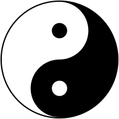

3. Teken een programma dat 13 vierkanten naast elkaar tekent met alle kleuren die standaard in java zitten: black, blue, cyan, darkGray, gray, green, lightGray, magenta, orange, pink, red, white, yellow
4. Teken een programma dat een rechthoek tekent over het gehele scherm met een RadialGradientPaint. Kies hier zelf een aantal kleuren voor uit, maar leg het centrum van de RadialPaint in het midden van het scherm (met getWidth()/2 en getHeight()/2). Voeg hierna een mousemotion listener toe, en leg het focuspunt van de RadialPaint op de locatie van de muis
5. Maak een applicatie om blokken te slepen, met een camera. Door met de rechtermuisknop te slepen kun je het complete scherm verslepen, met het scrollwieltje kun je de camera inzoomen en uitzoomen, en met de linker muisknop kun je een blok verslepen

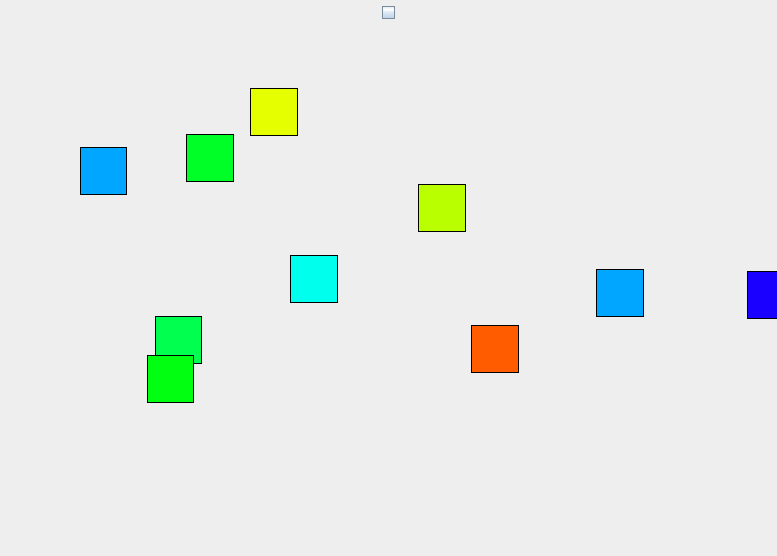

Let erop dat als je een blokje sleept, het blokje niet verspringt. Daarnaast moet het slepen natuurlijk ook werken als de camera verschoven of ingezoomed is.