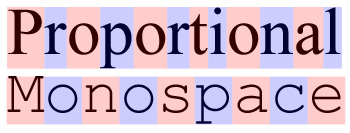
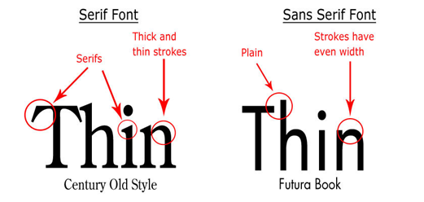
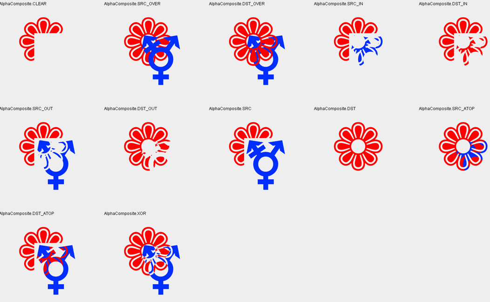

# Week 3

<!-- TOC -->

- [Week 3](#week-3)
    - [Tekst](#tekst)
    - [Afbeeldingen](#afbeeldingen)
        - [SpriteSheets](#spritesheets)
    - [Blending](#blending)
    - [Clipping](#clipping)
    - [Animeren met timers](#animeren-met-timers)
    - [Timing](#timing)
    - [Opgaven](#opgaven)

<!-- /TOC -->

## Tekst

We kunnen tekst op 't scherm zetten met de [```drawString(String text, float x, float y)```](https://docs.oracle.com/javase/7/docs/api/java/awt/Graphics2D.html#drawString(java.lang.String,%20float,%20float)) methode. Deze methode zal een tekst tekenen op de aangegeven positie, met de transformatie die op dat moment in het Graphics2D object staat opgeslagen. Daarnaast kunnen we een lettertype instellen met de [```setFont(Font font)```](https://docs.oracle.com/javase/7/docs/api/java/awt/Graphics.html#setFont(java.awt.Font)) methode. In dit font object staan de eigenschappen van het lettertype opgeslagen, zoals welk lettertype dit is, de afmetingen en de styling (_bold_, *italic*).

Omdat de geïnstalleerde lettertypen op iedere computer anders zijn, heeft java een aantal standaard lettertypen gedefinieerd:

- Serif
- SansSerif
- Monospaced
- Dialog
- Dialoginput



De standaard lettertypen die gebruikt worden zijn Proportional. Dit betekent dat alle letters een andere breedte hebben, en ook een eigen ruimte hebben tussen een letter en opvolgende letters. Dit leest prettiger voor gewone teksten. Voor sommige zaken, zoals code, is het prettiger een MonoSpaced font te gebruiken. In deze lettertypen zijn alle letters even breed, en hebben altijd dezelfde tussenruimte (tussen het begin van de letters). Hierdoor lijnt tekst beter uit.



Serifs (Nederlands: [Schreef](https://nl.wikipedia.org/wiki/Schreef)), zijn de uitstekende stukjes in een lettertype. Door gebruik te maken van een serif, krijgt een lettertype meer variatie, waardoor het gemakkelijker te herkennen is. Lettertypen met serif worden vooral gebruikt bij gedrukte tekst. Op een beeldscherm wordt meestal gebruik gemaakt van lettertypen zonder serif, omdat er bij de omzetting naar pixels maar een beperkt aantal pixels beschikbaar zijn, wat er voor zorgt dat de serif vaak erg klein zijn en afleiden van de rest van de letter.

Om een font te maken kan gebruik worden gemaakt van de [```Font(String name, int style, int size)```](https://docs.oracle.com/javase/7/docs/api/java/awt/Font.html#Font(java.lang.String,%20int,%20int)) constructor. De naam kan de naam van een lettertype op de PC zijn, maar kan ook een van de standaard java-lettertypen zijn (Serif, SansSerif, Monospaced, Dialog, Dialoginput). Deze namen staan ook opgeslagen in de Font-klasse, als Font.DIALOG en Font.MONOSPACED etc. De style geeft de stijl van het lettertype aan:

- Font.PLAIN
- Font.BOLD
- Font.ITALIC
- Font.BOLD &#124; Font.ITALIC

Daarnaast is het mogelijk om direct een TrueType font in te laden uit een bestand (dat je bijvoorbeeld mee kunt leveren met je applicatie), met de statische createFont methode:

```java
Font font = Font.createFont(Font.TRUETYPE_FONT, new File("A.ttf"));
```

Ook is het mogelijk om een lettertype af te leiden van een bestaand, ingeladen lettertype. Dit doe je met de [```Font.deriveFont()```](https://docs.oracle.com/javase/7/docs/api/java/awt/Font.html#deriveFont(float)) methoden. Met de verschillende deriveFont methoden kunnen de afmetingen, stijl of zelfs een complete transformatie op een font veranderd worden.

Om nu meer te kunnen doen met fonts, kunnen we deze ook omzetten naar een Shape, zodat we deze kunnen gebruiken met de fill en draw methoden. Iedere tekst zal dan dus wel een eigen Shape-object krijgen, dus dit is niet erg handig in gebruik van dynamische teksten. Met de volgende code kunnen we bijvoorbeeld een outline tekenen:

```java
public void paintComponent(Graphics g)
{
    super.paintComponent(g);
    Graphics2D g2d = (Graphics2D)g;

    Font font = new Font("Arial", Font.PLAIN, 30);
    Shape shape = font.createGlyphVector(g2d.getFontRenderContext(), "Hello World");
    g2d.draw(shape);
    g2d.draw(AffineTransform.getTranslateInstance(100,100).createTransformedShape(shape));
}

```

Door nu voor iedere letter een shape te maken, kunnen nog geavanceerdere teksteffecten bereikt worden, zoals het individueel verkleuren van letters tot het tekenen van tekst in een boog

## Afbeeldingen

De [Image](https://docs.oracle.com/javase/7/docs/api/java/awt/Image.html) klasse, is een abstracte klasse om met afbeeldingen te werken. Deze kun je echter niet zomaar aanmaken, omdat deze abstract is. Je kunt een afbeelding op 2 manieren aanmaken, uit een bestand inladen of een nieuwe lege afbeelding maken. Om een afbeelding in te laden vanuit een bestand en te tekenen, kunnen we de volgende code gebruiken:

```java
class HelloImage extends JPanel
{
    private BufferedImage image;
    public HelloImage()
    {
        try {
            image = ImageIO.read(getClass().getResource("/images/test.png"));
        } catch (Exception e) {
			e.printStackTrace();
		}
    }

    public void paintComponent(Graphics g)
    {
        super.paintComponent(g);
        Graphics2D g2d = (Graphics2D)g;

        AffineTransform tx = new AffineTransform();
        tx.translate(400,400);
        tx.rotate(Math.toRadians(45.0f), image.getWidth()/2, image.getHeight()/2);
        tx.scale(0.75f, 0.75f);
        g2d.drawImage(image, tx, null);
    }
}
```

Op deze manier wordt een afbeelding maar 1x ingeladen (in de constructor), en steeds herbruikt met het tekenen.

### SpriteSheets

 In games worden veel spritesheets gebruikt om animaties of meerdere gelijksoortige afbeeldingen op te slaan. Dit zijn afbeeldingen met meerdere kleine afbeeldingen erop. Een voordeel is dat je dan gemakkelijk door de afbeeldingen heen kunt lopen met een nummer door ze in een array te zetten. Daarnaast is het met veel graphics APIs sneller om stukjes van afbeeldingen te laten zien dan het tekenen van verschillende afbeeldingen.

Deze afbeeldingen kun je gemakkelijk opknippen in code, doordat alle afbeeldingen even groot zijn. Dit zou je kunnen doen met de volgende code:

```java
private BufferedImage[] tiles;
public HelloImage()
{
    try {
        BufferedImage image = ImageIO.read(getClass().getResource("/images/spritesheet.png"));
        tiles = new BufferedImage[24];
        //knip de afbeelding op in 24 stukjes van 32x32 pixels.
        for(int i = 0; i < 24; i++)
            tiles[i] = image.getSubImage(32 * (i%6), 32 * (i/6), 32, 32);
    } catch (Exception e) {
		e.printStackTrace();
	}

}
```

Sommige spritesheets hebben sprites die niet allemaal even groot zijn en niet op opvolgende plaasten staan. Hier zit dan altijd een extra bestand bij dat geparsed moet worden om de locatie van de sprites te vinden en uit te knippen.

## Blending

Standaard bij het tekenen van vormen en afbeeldingen zal java de nieuwe kleur over de oude kleur heenschrijven. Door de composite rules aan te passen kunnen we instellen hoe de nieuwe kleur over de oude kleur heenvalt. Het is ook mogelijk de twee kleuren te combineren. In de graphics wereld worden hierbij de termen Source en Destination gebruikt. Source is de kleur die je op dat moment aan het tekenen bent en destination is de kleur die al op 't scherm staat. De manieren van combineren staan in de [AlphaComposite](https://docs.oracle.com/javase/7/docs/api/java/awt/AlphaComposite.html) klasse. Via de ```AlphaComposite.getInstance()``` is het mogelijk om een nieuwe AlphaComposite aan te maken met een van de standaard-regels.



- CLEAR : maakt het scherm leeg op de plek waar getekent wordt.
- SRC_OVER : zet de nieuwe afbeelding over de oude afbeelding. Maakt hierbij gebruik van het alfakanaal van de nieuwe afbeelding.
- DST_OVER : zet de oorspronkelijke afbeelding over de nieuwe afbeelding. Maakt gebruik van het alfakanaal, tekent dus alleen op de plaatsen waar er nog niet getekend is.
- SRC_IN : Tekent alleen het gedeelte van de nieuwe afbeelding die op de oude afbeelding ligt.
- DST_IN : Vervangt het gedeelte van de destination dat in de source ligt.
- SRC_OUT : Het gedeelte van de source dat buiten de destination ligt vervangt de destination.
- DST_OUT : Het gedeelte van de destination dat buiten de source ligt vervangt de destination.
- SRC : Gebruikt alleen de source en blend niet met de destination.
- DST : Gebruikt alleen de destination en doet niets met de source.
- SRC_ATOP : Tekent alleen de source over de destination en houd rekening met alpha.
- DST_ATOP : Het gedeelte van de destination die over de source valt wordt getekend.
- XOR : Tekent alleen op plekken waar of de destination, of de source is, maar niet waar beide tekenen.

Daarnaast is bij sommige composite rules ook een floating point alpha waarde op te geven, deze geeft aan hoeveel geblend moet worden. Door SRC_OVER te nemen met een alpha van 0.5, zal de alpha-waarde van de destinationafbeelding voor iedere pixel met 0.5 vermenigvuldigd worden. Op deze manier kun je afbeeldingen en objecten in laten faden, door deze waarde te animeren van 0 naar 1.

```java
    public void paintComponent(Graphics g)
    {
        super.paintComponent(g);
        Graphics2D g2d = (Graphics2D)g;

        AffineTransform tx = new AffineTransform();

        g2d.setComposite(AlphaComposite.getInstance(AlphaComposite.SRC_OVER, 0.5f));
        g2d.fill(new Rectangle2D.Double(100,100,100,100));
    }
```

## Clipping

[](les3/clipping.png) Het is ook mogelijk om het tekenen op bepaalde gebieden van het scherm uit te zetten, zodat er niet getekent wordt. Dit noemen we clipping. De Graphics2D klasse heeft een ```setClip(Shape shape)``` methode, die een clipping-shape instelt. Als je ```null``` meegeeft als parameter, wordt de clipping uitgezet, en anders kan er alleen binnen de vorm getekend worden die je meegeeft. Dit kun je gebruiken om bijvoorbeeld een spotlight-effect te maken, of een vorm opvullen met andere shapes.

## Animeren met timers

Animatie in computer graphics wordt gedaan door het scherm steeds opnieuw te tekenen, waarbij objecten steeds een klein beetje veranderen. Door de X-coordinaat van een object op te hogen krijg je een beweging naar rechts. We kunnen dit proces opdelen in twee, van elkaar losstaande delen code; het updaten en het tekenen. Door nu intern variabelen op te slaan met de state van de applicatie, deze aan te passen in de update, en te gebruiken in de paintComponent kunnen we nu animeren. Voor het steeds opnieuw aanroepen van code gebruiken we de ```javax.swing.Timer``` klasse. Deze kunnen we via de volgende constructie aanmaken:

```java
import javax.swing.*;
import java.awt.*;
import java.awt.event.ActionEvent;
import java.awt.event.ActionListener;
import java.awt.geom.AffineTransform;
import java.awt.geom.Rectangle2D;

public class HelloAnimation extends JPanel implements ActionListener {
    public static void main(String[] args)
    {
        JFrame frame = new JFrame("Hello Java2D");
        frame.setDefaultCloseOperation(WindowConstants.EXIT_ON_CLOSE);
        frame.setMinimumSize(new Dimension(800, 600));
        frame.setExtendedState(frame.getExtendedState() | JFrame.MAXIMIZED_BOTH);
        frame.setContentPane(new HelloAnimation());
        frame.setVisible(true);
    }

    private double angle = 0;

    public HelloAnimation()
    {
        Timer t = new Timer(1000/60, this);
        t.start();
    }


    public void paintComponent(Graphics g)
    {
        super.paintComponent(g);
        Graphics2D g2d = (Graphics2D)g;

        AffineTransform tx = new AffineTransform();
        tx.translate(getWidth()/2, getHeight()/2);
        tx.rotate(angle);
        tx.translate(200, 0);

        g2d.fill(tx.createTransformedShape(new Rectangle2D.Double(-50,-50,100,100)));
    }

    @Override
    public void actionPerformed(ActionEvent e) {
        angle+=0.1;
        repaint();
    }
}
```

In de constructor van de timer geven we aan dat de actionPerformed methode 60x per seconde wordt aangeroepen. De actionPerformed methode bevat dan de code die uitgevoerd moet worden om alle objecten te bewegen en te animeren, waarna de repaint() aangeroepen wordt. De ```repaint()``` stuurt intern in Java een verzoek om het venster opnieuw te tekenen. Java2D zal dan zelf schedulen wanneer de paintComponent aangeroepen gaat worden. Je kunt meerdere keren repaint() aanroepen, maar dit betekent dus niet dat er ook meerdere keren opnieuw getekent wordt. Zorg er daarom dus voor dat de actionPerformed niet te veel zware code bevat, omdat er pas opnieuw getekend wordt zodra de actionPerformed afgerond is.

**Let op: de volgende code gaat dus niet werken:**

```java
import javax.swing.*;
import java.awt.*;
import java.awt.event.ActionEvent;
import java.awt.event.ActionListener;
import java.awt.geom.AffineTransform;
import java.awt.geom.Rectangle2D;

public class HelloAnimation extends JPanel implements ActionListener {
    public static void main(String[] args)
    {
        JFrame frame = new JFrame("Hello Java2D");
        frame.setDefaultCloseOperation(WindowConstants.EXIT_ON_CLOSE);
        frame.setMinimumSize(new Dimension(800, 600));
        frame.setExtendedState(frame.getExtendedState() | JFrame.MAXIMIZED_BOTH);
        frame.setContentPane(new HelloAnimation());
        frame.setVisible(true);
    }

    private double angle = 0;

    public HelloAnimation()
    {
        Timer t = new Timer(1000/60, this);
        t.start();
    }


    public void paintComponent(Graphics g)
    {
        super.paintComponent(g);
        Graphics2D g2d = (Graphics2D)g;

        AffineTransform tx = new AffineTransform();
        tx.translate(getWidth()/2, getHeight()/2);
        tx.rotate(angle);
        tx.translate(200, 0);

        g2d.fill(tx.createTransformedShape(new Rectangle2D.Double(-50,-50,100,100)));
    }

    @Override
    public void actionPerformed(ActionEvent e) {
        while(true)
        {
            angle+=0.1;
            repaint();
        }
    }
}
```

## Timing

De timer wordt standaard 60x per seconde aangeroepen, maar als de applicatie op een minder sterke PC uitgevoerd wordt, is het mogelijk dat de 60 beelden per seconde niet gehaald wordt. Dit kan ook gebeuren als er een zware berekening op de achtergrond gedaan wordt. Om er voor te zorgen dat alle objecten dan toch even snel blijven bewegen kunnen we gebruik maken van een tijdsmeting.

Door de tijd te meten tussen de huidige update- en de vorige update-aanroep, kunnen we een factor bepalen die we met alle snelheden kunnen vermenigvuldigen. We krijgen dan de volgende code:

```java
import javax.swing.*;
import java.awt.*;
import java.awt.event.ActionEvent;
import java.awt.event.ActionListener;
import java.awt.geom.AffineTransform;
import java.awt.geom.Rectangle2D;

public class HelloAnimation extends JPanel implements ActionListener {
    public static void main(String[] args)
    {
        JFrame frame = new JFrame("Hello Java2D");
        frame.setDefaultCloseOperation(WindowConstants.EXIT_ON_CLOSE);
        frame.setMinimumSize(new Dimension(800, 600));
        frame.setExtendedState(frame.getExtendedState() | JFrame.MAXIMIZED_BOTH);
        frame.setContentPane(new HelloAnimation());
        frame.setVisible(true);
    }

    private double angle = 0;
    private long lastTime = System.currentTimeMillis();

    HelloAnimation()
    {
        Timer t = new Timer(1000/15, this);
        t.start();
    }

    public void paintComponent(Graphics g)
    {
        super.paintComponent(g);
        Graphics2D g2d = (Graphics2D)g;

        AffineTransform tx = new AffineTransform();
        tx.translate(getWidth()/2, getHeight()/2);
        tx.rotate(angle);
        tx.translate(200, 0);

        g2d.fill(tx.createTransformedShape(new Rectangle2D.Double(-50,-50,100,100)));
    }

    @Override
    public void actionPerformed(ActionEvent e) {
        long currentTime = System.currentTimeMillis();
        double deltaTime = (currentTime - lastTime) / 1000.0;
        lastTime = currentTime;
        angle+=deltaTime;
        repaint();
    }
}

```

## Opgaven
1. [](les3/rainbow.png)Maak een applicatie die de tekst 'regenboog', in de vorm van een regenboog, in regenboogkleuren tekent. Je hoeft hiervoor niet de coordinaten van de letters te berekenen, maar dit kun je doen door middel van AffineTransform transformaties (eerst roteren, dan omhoog zetten)

2. [](les3/platformer_sprites_base.png)Download de gelinkte spritesheet van het lopende karakter. Laad deze afbeelding in, en hak deze op in stukjes. Laat hierna het karakter van links naar rechts over het venster lopen, met de loop-animatie. Laat zodra er met de muis geklikt wordt, de sprite stilstaan en een aanvalanimatie afspelen

3. Maak een applicatie die 2 afbeeldingen inlaad, en rustig tussen deze 2 afbeeldingen fade. Maak hierbij gebruik van alpha blending om een rustige overgang tussen de 2 afbeeldingen te maken. 

4. Maak een applicatie waarbij je met een soort 'spotlight' effect een achterliggende afbeelding kunt bekijken. Geef de spotlight een creatieve vorm.

5. [](les3/screensaver.gif)Maak de oude windows lijnen-screensaver. Deze screensaver bestaat uit een aantal punten (4 in de afbeelding bij de opgave), die over het scherm stuiteren. Zodra ze een rand van het scherm aanraken gaan ze de andere richting op (dus als x < 0, xrichting = -xrichting, etc). Daarna worden er lijnen tussen deze punten getekend. Voor ieder punt wordt daarnaast een geschiedenis opgeslagen, die gebruikt worden om de oude lijnen ook te tekenen