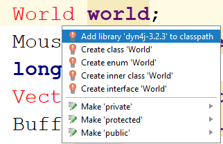

# Physics Engine

 Om een interactieve wereld te maken met objecten die reageren zoals in de werkelijke wereld moeten we dit uitprogrammeren, maar er kan ook gebruik gemaakt worden van een bestaande physics engine. Een voorbeeld van een bekende 2D physics engine is [Box2D](http://www.box2d.org), gebruikt in onder andere Angry Birds. Deze engine is echter geschreven in C++ en kunnen we niet gemakkelijk binnen java gebruiken. Gelukkig zijn er ook engines beschikbaar voor java, zoals [dyn4j](http://www.dyn4j.org). Deze engine wordt nog actief ontwikkeld, en bevat dezelfde concepten als andere physics engines, zoals RigidBodies, Fixtures en Joints.

## Installatie

 Om dyn4j te gebruiken, moeten we deze bij het project toevoegen. Je kunt de jarfile van [dync4j](http://www.dyn4j.org) downloaden en via verkenner in je project zetten. Door de jarfile hierna te markeren als library, kan IntelliJ deze jarfile gebruiken. Dit kun je doen door het bestand te rechtsklikken, en hierna op 'mark as library' te klikken. Hierna is de jarfile als library gemarkeerd en kunnen we deze gebruiken.



De library zal dan echter nog niet in het classpath van het project staan. De gemakkelijkste manier om dit toe te voegen is door een variabele te maken van het type World, en dan via de autocorrectie te kiezen om de library aan het classpath toe te voegen. Deze instellingen kun je natuurlijk ook in de module instellingen vinden, in het kopje Modules, op het tabblad 'Dependencies'.

## World

Alles in de physics engine speelt zich af in een wereld, een World object. Dit world object bevat alle objecten die zich in de wereld bevinden en heeft daarbij methoden om de wereld een tijdstap vooruit te zetten. Daarnaast heeft een wereld ook een aantal eigenschappen, zoals zwaartekracht en hulpmethoden om collision te bepalen en rays te casten. Om de world aan te maken, roepen we gewoon de constructor aan:

```java
    world = new World();
    world.setGravity(new Vector2(0,-9.8));
```

Deze wereld maakt gebruik van standaard eenheden, dus meters, kilogram en seconden (MKS). Om dit straks op het scherm af te beelden zal er dus een transformatie moeten gebruiken om van meters naar pixels te gaan. Deze transformatie is meestal een simpele schaling met een factor, en eventueel een translatie om de cameraview op de wereld te veranderen.

## Body

De basis voor alle objecten in de physics world is de Body klasse. Dit is een klasse voor een RigidBody, een object dat niet te vervormen is. Een Body heeft eigenschappen die het gedrag van een object bepalen, het gewicht, de positie, snelheid, rotatie en draaisnelheid. Daarnaast kunnen we het object beïnvloeden door er krachten op uit te oefenen, om deze te verplaatsen of te draaien.

## Fixture en Convex Shapes

Een body geeft de vorm van een object nog niet aan, dit wordt gedaan door middel van Convex Shapes. De shape wordt hierna gekoppeld aan de body door middel van een Fixture. De fixture geeft hierbij eigenschappen aan de vorm zoals hoe stuiterend de vorm is. In code:

```java
Body ball = new Body();
BodyFixture fixture = new BodyFixture(Geometry.createCircle(1));
fixture.setRestitution(.25);
ball.addFixture(fixture);
ball.getTransform().setTranslation(new Vector2(0,10));
ball.setMass(MassType.NORMAL);
world.addBody(ball);
```

Door de body nu met een fixture aan de world toe te voegen, kunnen we deze body simuleren. Dit doen we met de update methode. Deze methode wil weten hoeveel tijd er is verstreken sinds de vorige update aanroep, en zal op basis van deze tijd alle objecten verplaatsen en draaien. Om de bal te simuleren, kunnen we de volgende code gebruiken om de positie over een seconde te bekijken:

```java
for(int i = 0; i < 10; i++)
{
    world.update(0.1);
    System.out.println(ball.getTransform().getTranslation());
}
```

## Debug Draw

Een physics engine heeft normaal gesproken geen visualisatie. Dit betekent dus dat het systeem gespecialiseerd is in alleen het simuleren, en je het kunt combineren met verschillende manieren van tekenen voor maximale flexibiliteit. Om toch te helpen met de visualisatie van wat er in de physics engine gebeurt, kunnen we gebruik maken van een DebugDraw object. Dit is een eigengemaakt object dat over alle objecten uit de physics engine itereert, en ze hierna met simpele primitieven tekent. Een basis-voorbeeld van een debugdraw met dyn4j staat hieronder. Dit voorbeeld tekent alleen polygonen en cirkels, wat voldoende is voor een simpele scene

```java
import org.dyn4j.collision.Fixture;
import org.dyn4j.dynamics.Body;
import org.dyn4j.dynamics.World;
import org.dyn4j.geometry.Circle;
import org.dyn4j.geometry.Convex;
import org.dyn4j.geometry.Polygon;
import org.dyn4j.geometry.Vector2;

import java.awt.Graphics2D;
import java.awt.Shape;
import java.awt.geom.AffineTransform;
import java.awt.geom.Ellipse2D;
import java.awt.geom.GeneralPath;

public class DebugDraw {
    public static void draw(Graphics2D g2d, World world, double scale) {
        for(Body b : world.getBodies())
        {
            AffineTransform originalTransform = g2d.getTransform();

            AffineTransform bodyTransform = new AffineTransform();
            bodyTransform.translate(b.getTransform().getTranslationX() * scale, b.getTransform().getTranslationY() * scale);
            bodyTransform.rotate(b.getTransform().getRotation());
            g2d.transform(bodyTransform);


            for(Fixture f : b.getFixtures())
                g2d.draw(AffineTransform.getScaleInstance(scale,scale).createTransformedShape(getShape(f.getShape(), scale)));


            g2d.setTransform(originalTransform);
        }
    }

    private static Shape getShape(Convex shape, double scale) {
        if(shape instanceof Polygon)
            return getShape((Polygon)shape, scale);
        if(shape instanceof Circle)
            return getShape((Circle)shape, scale);
        else
            System.out.println("Unsupported shape: " + shape);
        return null;
    }

    private static Shape getShape(Polygon shape, double scale) {
        GeneralPath path = new GeneralPath();
        Vector2[] vertices = shape.getVertices();
        path.moveTo(vertices[0].x, vertices[0].y);
        for(int i = 1; i < vertices.length; i++)
            path.lineTo(vertices[i].x, vertices[i].y);
        path.closePath();
        return path;
    }

    private static Shape getShape(Circle shape, double scale) {
        return new Ellipse2D.Double(shape.getCenter().x - shape.getRadius(),
                                    shape.getCenter().y - shape.getRadius(),
                                    shape.getRadius()*2,
                                    shape.getRadius()*2);
    }
}
```

Om deze debugdraw nu te gebruiken moeten we een Graphics2D object meegeven, de world die we willen tekenen en een schaal: ```DebugDraw.draw(g2d, world, 100.0);```. Deze schaal is nodig omdat als we de schaal in de Graphics2D.setTransform() meegeven, de lijnen erg dik worden.

## Plaatjes en echt gebruik

In de meeste games wordt gebruik gemaakt van sprites voor de verschillende objecten. We kunnen bijvoorbeeld een basketbalgame maken, waarbij we een afbeelding van een bal gebruiken, zodat er meer detail in zit dan een simpele shape. In de tekencode halen we dan de positie en rotatie van de bal-Body op, en gebruiken deze om een afbeelding op de juiste plaats te zetten.

Daarnaast kunnen we ook gebruik maken van de timer om de wereld automatisch te updaten. In de timer nemen we de code voor de [dynamische tijdstap](Les3#timing) over om de tijdstappen te berekenen voor de update methode. Daarnaast slaan we de objecten die we willen tekenen in een nieuw wrapper-object op. Dit object bevat een Body en een afbeelding. Daarnaast hebben we ook twee attributen: offset en scale om de afbeelding netjes over de Body te laten vallen.

```java
import org.dyn4j.dynamics.Body;
import org.dyn4j.geometry.Convex;
import org.dyn4j.geometry.Vector2;

import javax.imageio.ImageIO;
import java.awt.*;
import java.awt.geom.AffineTransform;
import java.awt.image.BufferedImage;
import java.io.IOException;

public class GameObject
{
    Body body;
    BufferedImage image;
    Vector2 offset;
    double scale;

    GameObject(String imageFile, Body body, Vector2 offset, double scale)
    {
        this.body = body;
        this.offset = offset;
        this.scale = scale;
        try {
            image = ImageIO.read(getClass().getResource(imageFile));
        } catch (IOException e) {
            e.printStackTrace();
        }
    }

    public void draw(Graphics2D g2d)
    {
        if(image == null)
            return;

        AffineTransform tx = new AffineTransform();
        tx.translate(body.getTransform().getTranslationX() * 100, body.getTransform().getTranslationY() * 100);
        tx.rotate(body.getTransform().getRotation());
        tx.scale(scale, -scale);
        tx.translate(offset.x, offset.y);

        tx.translate(-image.getWidth()/2, -image.getHeight()/2);
        g2d.drawImage(image, tx, null);
    }
}
```
We kunnen nu in ons paneel een lijst van gameobjects gaan opslaan, en deze vullen in de constructor van het panel:

```java
gameObjects = new ArrayList<GameObject>();
Body ball = new Body();
ball.addFixture(Geometry.createCircle(0.15));
ball.getTransform().setTranslation(0,2.4);
ball.setMass(MassType.NORMAL);
ball.getFixture(0).setRestitution(0.75);
world.addBody(ball);
gameObjects.add(new GameObject("/images/basketball.png", ball, new Vector2(0,0), 0.05));
```

de update wordt dan:

```java
private long lastTime;
public void actionPerformed(ActionEvent e) {
    long time = System.nanoTime();
    double elapsedTime = (time-lastTime) / 1000000000.0;
    lastTime = time;

    world.update(elapsedTime);

    repaint();
}
```

en de paintComponent:

```java
public void paintComponent(Graphics g)
{
    super.paintComponent(g);
    Graphics2D g2d = (Graphics2D) g;

    for(GameObject gameobject : gameObjects)
        gameobject.draw(g2d);
}
```

Voor een complete demo, zie de Hello_Basketball module in week 5

## Meer over fixtures

Fixtures bevatten informatie over de vormen van je Bodies. Je kunt verschillende vormen gebruiken om aan het object te koppelen, en deze vormen kun je ook combineren. Deze vormen kun je aanmaken via de statische methoden in de [Geometry](http://docs.dyn4j.org/v3.2.4/org/dyn4j/geometry/Geometry.html) klasse. Een aantal van deze vormen zijn:

- Circle
- Ellipse
- Capsule
- Rectangle
- Triangle
- Polygon
- Square
- Rectangle

Deze shapes zijn vanwege efficientie veel specifieker dan in het tekenen met Java2D. Collision met een cirkel is gemakkelijker te berekenen dan collision met een ellipse. Gebruik dus altijd de simpelste vorm.

Daarnaast kun je in een fixture restitution

## Joints

### Distance Joint

### Revolute Joint

### Weld Joint

### Prismatic Joint

## Raycasting en collision testing

## Gebruik - Het slepen van een object met je muis

## Opdrachten

1. Maak angry birds

2. 